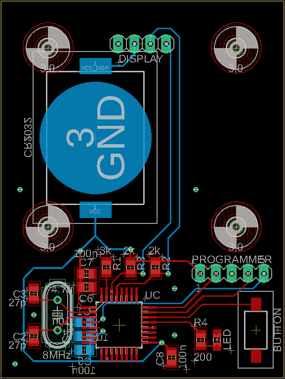
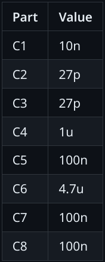
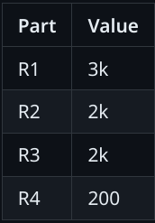

# What it's about

In summer I've done a soldering workshop for some teens. Because I wanted the workshop to be cool and challenging at the same time I designed a PCB ("Printed Circuit Board") tailored to my requirements. It has a mikrocontroller, an OLED-display, a button, LED and some SMD parts. \
When the button is pressed the display shows a text and the LED blinks, both for a time duration of ten minutes. The PCB is powered by a CR2032 coin cell battery.  

{:width="100"}

# The PCB design

The PCB is designed in order to be challenging but also to be fun to solder. Therefore the parts are surface mounted (SMD parts) with a size of 0805 which is kind of small, but not too small ;)  
 - The mikrocontroller is a [_STM32L062K8_](https://www.st.com/en/microcontrollers-microprocessors/stm32l062k8.html) from ST Microelectronics in a 32 pin LQFP package.

 - The OLED-display is bought from Amazon and is 1.3 inch in size. It communicates with the uC using the I2C protocol. The display is mounted on the main PCB with four screws.

 - For the processor clock an external crystal is used. It clocks with 8 MHz. Well, actually the external crystal is quite overkill but it looks cool.  

 - Button debouncing is done in software in order to keep the PCB simple and because the workshop time was limited.  

  

  
# The parts

- Mikrocontroller \
[_STM32L062K8_](https://www.st.com/en/microcontrollers-microprocessors/stm32l062k8.html) (LQFP32 package)

- Button \
[_PTS636 SL43 SMTR LFS_](https://www.mouser.de/ProductDetail/CK/PTS636-SL43-SMTR-LFS?qs=vLWxofP3U2x0maTON%2FqK1g%3D%3D)

- Crystal \
[_ECS-80-18-4X-CKM_](https://www.mouser.de/ProductDetail/ECS/ECS-80-18-4X-CKM?qs=7MVldsJ5UazWVU6%2F43NmVA%3D%3D)

- 1.3 inch OLED display \
[_Link to Amazon_](https://www.amazon.de/AZDelivery-Display-Arduino-Raspberry-Gratis/dp/B078J78R45/ref=sr_1_2?__mk_de_DE=%C3%85M%C3%85%C5%BD%C3%95%C3%91&crid=2BH0U7SKDYO6I&keywords=oled%2B1.3&qid=1688516225&sprefix=oled%2B1.3%2Caps%2C98&sr=8-2&th=1)

- SMD LED \
[LG R971-KN-1](https://www.mouser.de/ProductDetail/ams-OSRAM/LG-R971-KN-1?qs=LsPilcdHE7EX1EB7GCLHxg%3D%3D) (size 0805)

- SMD capacitors and resistors (see down below)

- Pin header

- Coin battery _CR2032_

- SMD coin battery holder 

- screws and screw nuts (4x)
 
## Capacitors (size 0805)

## Resistors (size 0805)

# Eagle files
The eagle design files are located in [_my github repo in the folder "eagle-files"_](https://github.com/simon-cybersec/Workshop-PCB).  

# How to flash the uC
In order to flash the uC the _serial wire debug_ (SWD) protocol is used. The corresponding pins of the uC are layouted to the PCBs pinheader (have a look at the eagle files). I used a NUCLEO-development-board from ST, which is not only able to flash its own uC but also can flash external ones.  

